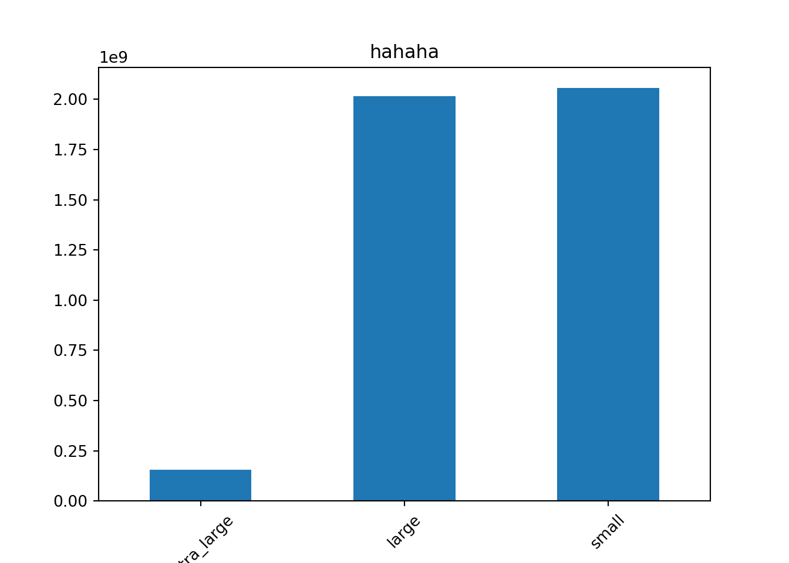
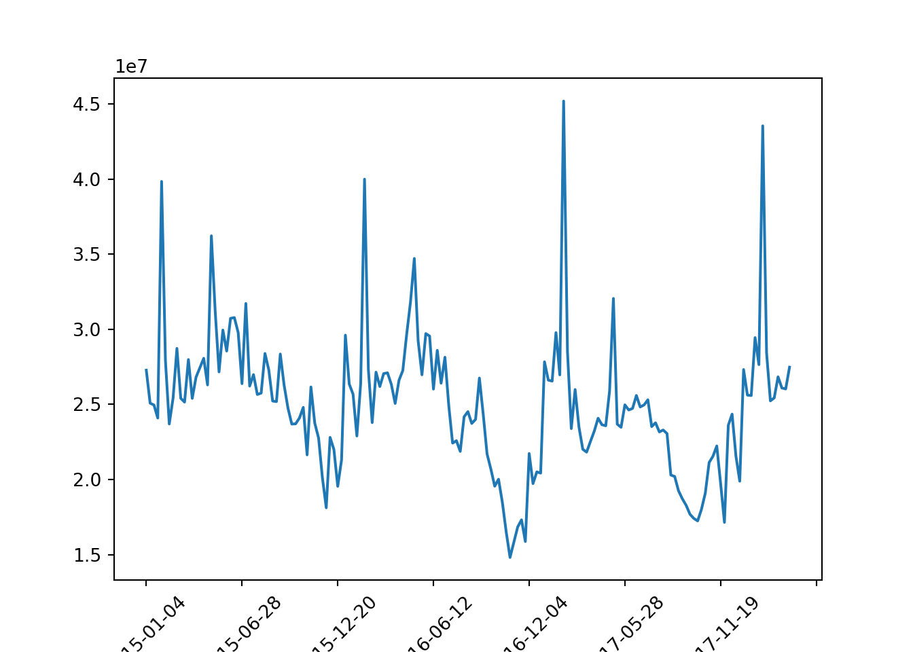
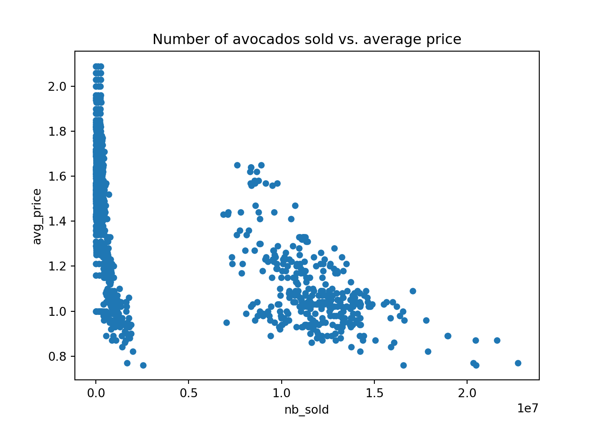
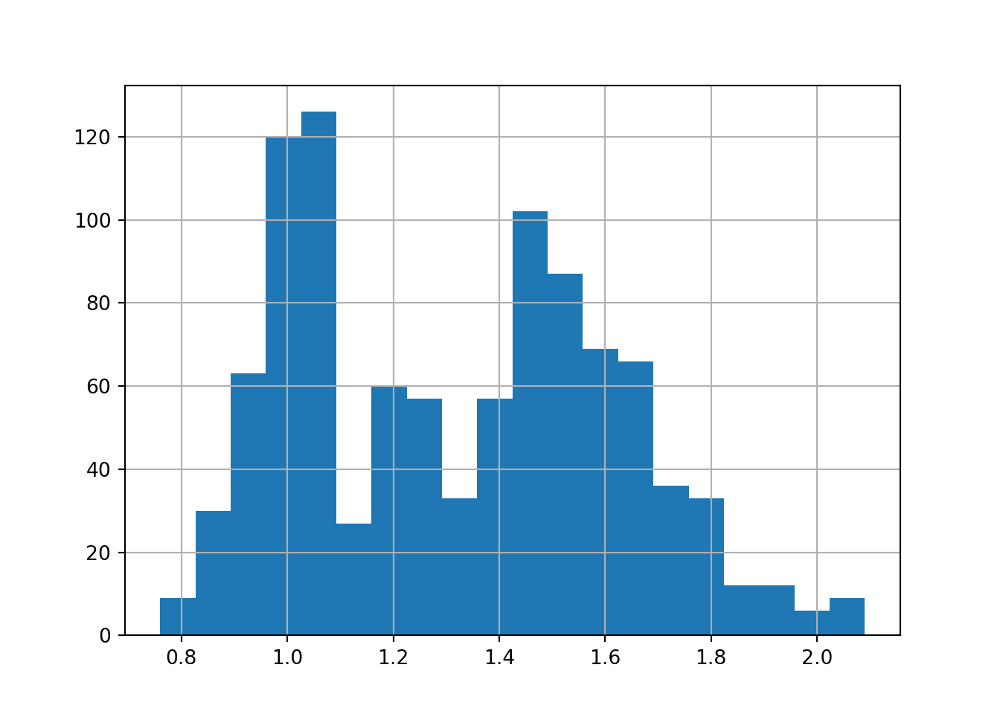
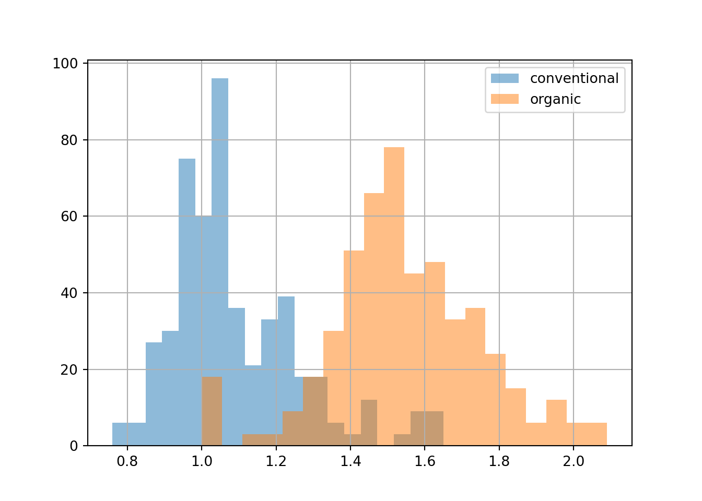
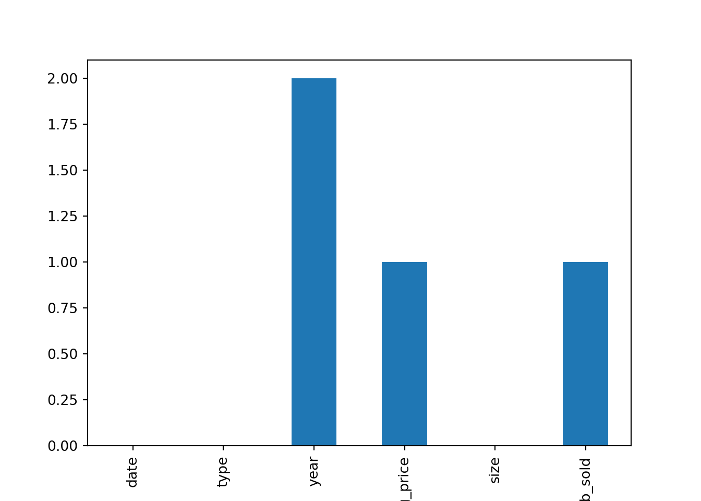

# Pandas basics


```python
import pandas as pd
```

## Inspecting DataFrame

-   拿到資料的第一步，就是去看看這份資料裡有甚麼東西\

-   在R裡面，最常用的就是 `head()`來先看前幾筆，`dim()`來看一下列數和行數，`str()`來看各欄位的type，用`summary`來看各欄位的描述統計量

-   在Python也是一樣，只是R都是用function，但python是物件導向，所以是用methods

    | R           | Python        |
    |-------------|---------------|
    | head(df, n) | df.head(n)    |
    | dim(df)     | df.shape      |
    | str(df)     | df.info()     |
    | summary(df) | df.describe() |

-   接下來我們就來讀一筆資料，然後看看這些結果


```python
homelessness = pd.read_csv("data/homelessness.csv")
```


```python
homelessness.head()
#>    Unnamed: 0              region  ... family_members  state_pop
#> 0           0  East South Central  ...          864.0    4887681
#> 1           1             Pacific  ...          582.0     735139
#> 2           2            Mountain  ...         2606.0    7158024
#> 3           3  West South Central  ...          432.0    3009733
#> 4           4             Pacific  ...        20964.0   39461588
#> 
#> [5 rows x 6 columns]
```

-   這筆資料是在描述美國各州無家可歸的人數有多少\
-   第二個欄位和第一個欄位，就在講是哪個州的哪個地區\
-   第三個欄位的individuals在講the number of homeless individuals not part of a family with children\
-   第四個欄位的family\_members在講the number of homeless individuals part of a family with children\
-   第五個欄位是這個州的人口有多少


```python
homelessness.shape
#> (51, 6)
```

-   這筆資料有51的rows，5個column


```python
homelessness.info()
#> <class 'pandas.core.frame.DataFrame'>
#> RangeIndex: 51 entries, 0 to 50
#> Data columns (total 6 columns):
#>  #   Column          Non-Null Count  Dtype  
#> ---  ------          --------------  -----  
#>  0   Unnamed: 0      51 non-null     int64  
#>  1   region          51 non-null     object 
#>  2   state           51 non-null     object 
#>  3   individuals     51 non-null     float64
#>  4   family_members  51 non-null     float64
#>  5   state_pop       51 non-null     int64  
#> dtypes: float64(2), int64(2), object(2)
#> memory usage: 2.5+ KB
```


```python
homelessness.describe()
#>        Unnamed: 0    individuals  family_members     state_pop
#> count   51.000000      51.000000       51.000000  5.100000e+01
#> mean    25.000000    7225.784314     3504.882353  6.405637e+06
#> std     14.866069   15991.025083     7805.411811  7.327258e+06
#> min      0.000000     434.000000       75.000000  5.776010e+05
#> 25%     12.500000    1446.500000      592.000000  1.777414e+06
#> 50%     25.000000    3082.000000     1482.000000  4.461153e+06
#> 75%     37.500000    6781.500000     3196.000000  7.340946e+06
#> max     50.000000  109008.000000    52070.000000  3.946159e+07
```

## Parts of a DataFrame

-   對data有初步認識後，我們常常就會想來擷取這份data的部分資訊\

-   除了擷取某些column，某些row外，在R我們也常常用`colnames()`和`rownames()`，來擷取dataframe的column names & row names\

-   在Python，一樣，又是因為物件導向，所以他是用attribute(因為是這份df的特性，而不是methods，所以使用時，也不用加括號)來得到這些資訊

    | R              | Python       |
    |----------------|--------------|
    | colnames(data) | data.columns |
    | rownames(data) | data.index   |
    |                | data.values  |


```python
print(homelessness.columns)
#> Index(['Unnamed: 0', 'region', 'state', 'individuals', 'family_members',
#>        'state_pop'],
#>       dtype='object')
```


```python
print(homelessness.index)
#> RangeIndex(start=0, stop=51, step=1)
```

-   最後，python比R多出來的東西，是value，他可以只取出DataFrame裡面的值。那此時的data type，就會是二維list:


```python
homelessness.values
#> array([[0, 'East South Central', 'Alabama', 2570.0, 864.0, 4887681],
#>        [1, 'Pacific', 'Alaska', 1434.0, 582.0, 735139],
#>        [2, 'Mountain', 'Arizona', 7259.0, 2606.0, 7158024],
#>        [3, 'West South Central', 'Arkansas', 2280.0, 432.0, 3009733],
#>        [4, 'Pacific', 'California', 109008.0, 20964.0, 39461588],
#>        [5, 'Mountain', 'Colorado', 7607.0, 3250.0, 5691287],
#>        [6, 'New England', 'Connecticut', 2280.0, 1696.0, 3571520],
#>        [7, 'South Atlantic', 'Delaware', 708.0, 374.0, 965479],
#>        [8, 'South Atlantic', 'District of Columbia', 3770.0, 3134.0,
#>         701547],
#>        [9, 'South Atlantic', 'Florida', 21443.0, 9587.0, 21244317],
#>        [10, 'South Atlantic', 'Georgia', 6943.0, 2556.0, 10511131],
#>        [11, 'Pacific', 'Hawaii', 4131.0, 2399.0, 1420593],
#>        [12, 'Mountain', 'Idaho', 1297.0, 715.0, 1750536],
#>        [13, 'East North Central', 'Illinois', 6752.0, 3891.0, 12723071],
#>        [14, 'East North Central', 'Indiana', 3776.0, 1482.0, 6695497],
#>        [15, 'West North Central', 'Iowa', 1711.0, 1038.0, 3148618],
#>        [16, 'West North Central', 'Kansas', 1443.0, 773.0, 2911359],
#>        [17, 'East South Central', 'Kentucky', 2735.0, 953.0, 4461153],
#>        [18, 'West South Central', 'Louisiana', 2540.0, 519.0, 4659690],
#>        [19, 'New England', 'Maine', 1450.0, 1066.0, 1339057],
#>        [20, 'South Atlantic', 'Maryland', 4914.0, 2230.0, 6035802],
#>        [21, 'New England', 'Massachusetts', 6811.0, 13257.0, 6882635],
#>        [22, 'East North Central', 'Michigan', 5209.0, 3142.0, 9984072],
#>        [23, 'West North Central', 'Minnesota', 3993.0, 3250.0, 5606249],
#>        [24, 'East South Central', 'Mississippi', 1024.0, 328.0, 2981020],
#>        [25, 'West North Central', 'Missouri', 3776.0, 2107.0, 6121623],
#>        [26, 'Mountain', 'Montana', 983.0, 422.0, 1060665],
#>        [27, 'West North Central', 'Nebraska', 1745.0, 676.0, 1925614],
#>        [28, 'Mountain', 'Nevada', 7058.0, 486.0, 3027341],
#>        [29, 'New England', 'New Hampshire', 835.0, 615.0, 1353465],
#>        [30, 'Mid-Atlantic', 'New Jersey', 6048.0, 3350.0, 8886025],
#>        [31, 'Mountain', 'New Mexico', 1949.0, 602.0, 2092741],
#>        [32, 'Mid-Atlantic', 'New York', 39827.0, 52070.0, 19530351],
#>        [33, 'South Atlantic', 'North Carolina', 6451.0, 2817.0, 10381615],
#>        [34, 'West North Central', 'North Dakota', 467.0, 75.0, 758080],
#>        [35, 'East North Central', 'Ohio', 6929.0, 3320.0, 11676341],
#>        [36, 'West South Central', 'Oklahoma', 2823.0, 1048.0, 3940235],
#>        [37, 'Pacific', 'Oregon', 11139.0, 3337.0, 4181886],
#>        [38, 'Mid-Atlantic', 'Pennsylvania', 8163.0, 5349.0, 12800922],
#>        [39, 'New England', 'Rhode Island', 747.0, 354.0, 1058287],
#>        [40, 'South Atlantic', 'South Carolina', 3082.0, 851.0, 5084156],
#>        [41, 'West North Central', 'South Dakota', 836.0, 323.0, 878698],
#>        [42, 'East South Central', 'Tennessee', 6139.0, 1744.0, 6771631],
#>        [43, 'West South Central', 'Texas', 19199.0, 6111.0, 28628666],
#>        [44, 'Mountain', 'Utah', 1904.0, 972.0, 3153550],
#>        [45, 'New England', 'Vermont', 780.0, 511.0, 624358],
#>        [46, 'South Atlantic', 'Virginia', 3928.0, 2047.0, 8501286],
#>        [47, 'Pacific', 'Washington', 16424.0, 5880.0, 7523869],
#>        [48, 'South Atlantic', 'West Virginia', 1021.0, 222.0, 1804291],
#>        [49, 'East North Central', 'Wisconsin', 2740.0, 2167.0, 5807406],
#>        [50, 'Mountain', 'Wyoming', 434.0, 205.0, 577601]], dtype=object)
```


```python
type(homelessness.values)
#> <class 'numpy.ndarray'>
```

## select, filter, arrange, & mutate

-   在R裡面，我最常用到的四個函數，在pandas裡面都有對應的method可以用

### select

| dplyr                  | Pandas                               |
|------------------------|--------------------------------------|
| select(df, col1)       | df["col1"]是series, df[["col1"]]是df |
| select(df, col1, col2) | df[["col1", "col2"]                  |
| select(df, col1:col3)  | df.loc[:, "col1":"col3"]                 |

-   來練習吧：我想先select "individual"這個欄位


```python
ind_series = homelessness["individuals"]
print(type(ind_series))
#> <class 'pandas.core.series.Series'>
```


```python
ind_series.head()
#> 0      2570.0
#> 1      1434.0
#> 2      7259.0
#> 3      2280.0
#> 4    109008.0
#> Name: individuals, dtype: float64
```


```python
ind_df = homelessness[["individuals"]]
print(type(ind_df))
#> <class 'pandas.core.frame.DataFrame'>
```


```python
print(ind_df.head())
#>    individuals
#> 0       2570.0
#> 1       1434.0
#> 2       7259.0
#> 3       2280.0
#> 4     109008.0
```

-   再來，我想select "state"和"family\_members"這兩個column


```python
state_fam = homelessness[["state", "family_members"]]
print(state_fam.head())
#>         state  family_members
#> 0     Alabama           864.0
#> 1      Alaska           582.0
#> 2     Arizona          2606.0
#> 3    Arkansas           432.0
#> 4  California         20964.0
```

-   再來，我想select從individuals到family\_members


```python
ind_to_fam = homelessness.loc[:, "individuals":"family_members"]
print(ind_to_fam.head())
#>    individuals  family_members
#> 0       2570.0           864.0
#> 1       1434.0           582.0
#> 2       7259.0          2606.0
#> 3       2280.0           432.0
#> 4     109008.0         20964.0
```

### filter  

* 篩選出individuals > 10000的資料  


```python
homelessness.query("individuals > 10000")
#>     Unnamed: 0              region  ... family_members  state_pop
#> 4            4             Pacific  ...        20964.0   39461588
#> 9            9      South Atlantic  ...         9587.0   21244317
#> 32          32        Mid-Atlantic  ...        52070.0   19530351
#> 37          37             Pacific  ...         3337.0    4181886
#> 43          43  West South Central  ...         6111.0   28628666
#> 47          47             Pacific  ...         5880.0    7523869
#> 
#> [6 rows x 6 columns]
```

* 篩選出region = "Mountain"的資料  


```python
homelessness.query("region == 'Mountain'").head()
#>     Unnamed: 0    region     state  individuals  family_members  state_pop
#> 2            2  Mountain   Arizona       7259.0          2606.0    7158024
#> 5            5  Mountain  Colorado       7607.0          3250.0    5691287
#> 12          12  Mountain     Idaho       1297.0           715.0    1750536
#> 26          26  Mountain   Montana        983.0           422.0    1060665
#> 28          28  Mountain    Nevada       7058.0           486.0    3027341
```

* 篩選出family members < 1000 & region = "Pacific"  


```python
homelessness.query("family_members < 1000 & region == 'Pacific'")
#>    Unnamed: 0   region   state  individuals  family_members  state_pop
#> 1           1  Pacific  Alaska       1434.0           582.0     735139
```

* 篩選出region是"South Atlantic"或是"Mid_atlantic"  


```python
homelessness[homelessness["region"].isin(["South Atlantic", "Mid_atlantic"])]
#>     Unnamed: 0          region  ... family_members  state_pop
#> 7            7  South Atlantic  ...          374.0     965479
#> 8            8  South Atlantic  ...         3134.0     701547
#> 9            9  South Atlantic  ...         9587.0   21244317
#> 10          10  South Atlantic  ...         2556.0   10511131
#> 20          20  South Atlantic  ...         2230.0    6035802
#> 33          33  South Atlantic  ...         2817.0   10381615
#> 40          40  South Atlantic  ...          851.0    5084156
#> 46          46  South Atlantic  ...         2047.0    8501286
#> 48          48  South Atlantic  ...          222.0    1804291
#> 
#> [9 rows x 6 columns]
```

### arrange  

* 我想看individuals的top5  


```python
homelessness.sort_values("individuals", ascending = False).head()
#>     Unnamed: 0              region  ... family_members  state_pop
#> 4            4             Pacific  ...        20964.0   39461588
#> 32          32        Mid-Atlantic  ...        52070.0   19530351
#> 9            9      South Atlantic  ...         9587.0   21244317
#> 43          43  West South Central  ...         6111.0   28628666
#> 47          47             Pacific  ...         5880.0    7523869
#> 
#> [5 rows x 6 columns]
```

* 我想先依照region由小到大排，然後，region平手的，再依照family_members由大到小排，最後print出前五個  


```python
homelessness.sort_values(["region", "family_members"], ascending = [True, False]).head()
#>     Unnamed: 0              region  ... family_members  state_pop
#> 13          13  East North Central  ...         3891.0   12723071
#> 35          35  East North Central  ...         3320.0   11676341
#> 22          22  East North Central  ...         3142.0    9984072
#> 49          49  East North Central  ...         2167.0    5807406
#> 14          14  East North Central  ...         1482.0    6695497
#> 
#> [5 rows x 6 columns]
```

### mutate and rename  

* 我想新增一個total的欄位，定義為individuals + family_members  


```python
new = homelessness.assign(total = homelessness["individuals"]+homelessness["family_members"])

new[["individuals", "family_members", "total"]].head()
#>    individuals  family_members     total
#> 0       2570.0           864.0    3434.0
#> 1       1434.0           582.0    2016.0
#> 2       7259.0          2606.0    9865.0
#> 3       2280.0           432.0    2712.0
#> 4     109008.0         20964.0  129972.0
```
* 我想把new這個table的"region"改名為region2就好  


```python
new.rename(columns = {"region": "region2"}).head()
#>    Unnamed: 0             region2  ... state_pop     total
#> 0           0  East South Central  ...   4887681    3434.0
#> 1           1             Pacific  ...    735139    2016.0
#> 2           2            Mountain  ...   7158024    9865.0
#> 3           3  West South Central  ...   3009733    2712.0
#> 4           4             Pacific  ...  39461588  129972.0
#> 
#> [5 rows x 7 columns]
```

### summarise  

* 接下來，先讀一個新的資料集  


```python
sales = pd.read_csv("data/sales_subset.csv")
sales.shape
#> (10774, 10)
```

* 看一下內容：  


```python
sales.head()
#>    Unnamed: 0  store type  ...  temperature_c fuel_price_usd_per_l  unemployment
#> 0           0      1    A  ...       5.727778             0.679451         8.106
#> 1           1      1    A  ...       8.055556             0.693452         8.106
#> 2           2      1    A  ...      16.816667             0.718284         7.808
#> 3           3      1    A  ...      22.527778             0.748928         7.808
#> 4           4      1    A  ...      27.050000             0.714586         7.808
#> 
#> [5 rows x 10 columns]
```

* 看一下overall:  


```python
sales.info()
#> <class 'pandas.core.frame.DataFrame'>
#> RangeIndex: 10774 entries, 0 to 10773
#> Data columns (total 10 columns):
#>  #   Column                Non-Null Count  Dtype  
#> ---  ------                --------------  -----  
#>  0   Unnamed: 0            10774 non-null  int64  
#>  1   store                 10774 non-null  int64  
#>  2   type                  10774 non-null  object 
#>  3   department            10774 non-null  int64  
#>  4   date                  10774 non-null  object 
#>  5   weekly_sales          10774 non-null  float64
#>  6   is_holiday            10774 non-null  bool   
#>  7   temperature_c         10774 non-null  float64
#>  8   fuel_price_usd_per_l  10774 non-null  float64
#>  9   unemployment          10774 non-null  float64
#> dtypes: bool(1), float64(4), int64(3), object(2)
#> memory usage: 768.2+ KB
```

* 算出"weekly_sales"的mean  


```python
sales["weekly_sales"].mean()
#> 23843.95014850566
```

* 先定義四分位差，然後去計算temperature_c, fuel_price_usd_per_l, unemployment的四分位差  


```python
import numpy as np
def iqr(x):
  return x.quantile(0.75) - x.quantile(0.25)

sales[["temperature_c", "fuel_price_usd_per_l", "unemployment"]].agg([iqr, np.mean, np.min, np.max])
#>       temperature_c  fuel_price_usd_per_l  unemployment
#> iqr       16.583333              0.073176      0.565000
#> mean      15.731978              0.749746      8.082009
#> amin      -8.366667              0.664129      3.879000
#> amax      33.827778              1.107674      9.765000
```

### group_by + summarise  

* 我想先group_by "type(A, B, C)"，再計算weekly_sales的sum  


```python
tt_series = sales.groupby("type")["weekly_sales"].sum()
print(tt_series)
#> type
#> A    2.337163e+08
#> B    2.317840e+07
#> Name: weekly_sales, dtype: float64
print(type(tt_series))
#> <class 'pandas.core.series.Series'>
```


```python
tt_df = sales.groupby("type")[["weekly_sales"]].sum()
print(tt_df)
#>       weekly_sales
#> type              
#> A     2.337163e+08
#> B     2.317840e+07
print(type(tt_df))
#> <class 'pandas.core.frame.DataFrame'>
```

* 我想by "type"+"is_holiday"，去算出weekly_sales的sum, min, max  


```python
tt_group = sales.groupby(["type", "is_holiday"])["weekly_sales"].agg([np.min, np.max])
print(tt_group)
#>                     amin       amax
#> type is_holiday                    
#> A    False      -1098.00  293966.05
#>      True        -598.00    5350.00
#> B    False       -798.00  232558.51
#>      True          31.41    1590.00
print(type(tt_group))
#> <class 'pandas.core.frame.DataFrame'>
```

## slice by .loc[列名, 行名] and .iloc[列數, 行數]

-   loc and iloc是pandas的method，所以是用`data.loc[列名,行名]`, `data.iloc[列index,行index]`來運作

+-------------------------------------------------------------+---------------------------------------------+
| 說明                                                        | pandas                                      |
+=============================================================+=============================================+
| 取[某列,某行]，得value (此時不再是df type)                  | df.loc["列名1","行名2"]                     |
+-------------------------------------------------------------+---------------------------------------------+
| 若要維持df type，要加中括號                                 | df.loc[["列名1"],["行名2"]]                 |
+-------------------------------------------------------------+---------------------------------------------+
| 取多個列，多個行                                            | df.loc[["列名1","列名2"],["行名2","行名2"]] |
+-------------------------------------------------------------+---------------------------------------------+
| 若要取多個列就好，行我全要                                  | 錯誤: df.loc[[列名1, 列名2], :]             |
|                                                             |                                             |
|                                                             | 正確: df.loc[[列名1, 列名2]]                |
+-------------------------------------------------------------+---------------------------------------------+
| 若要取多個行就好，列我全要                                  | df.loc[:, [行名1, 行名2]]                   |
+-------------------------------------------------------------+---------------------------------------------+
| .iloc就是把列名全改成列數(0開始), 行名全改成行數(0開始)就好 | df.iloc[0,2] \# 返回value                   |
|                                                             |                                             |
|                                                             | df.iloc[[0],[2]] \# 返回df type             |
|                                                             |                                             |
|                                                             | df.iloc[[0,2], [0,1]] \#多列多行            |
|                                                             |                                             |
|                                                             | df.iloc[[0,2]] \# 多列                      |
|                                                             |                                             |
|                                                             | df.iloc[:, [0,1]] \# 多行                   |
+-------------------------------------------------------------+---------------------------------------------+

-   這邊先讀個檔，複習這兩種用法：


```python
cars = pd.read_csv("data/cars.csv", index_col=0)
cars
#>      cars_per_cap        country  drives_right
#> US            809  United States          True
#> AUS           731      Australia         False
#> JAP           588          Japan         False
#> IN             18          India         False
#> RU            200         Russia          True
#> MOR            70        Morocco          True
#> EG             45          Egypt          True
```

-   可以看到最左邊有rownames, 每個column有colnames

### 取某列某行(得到value, 非df type)

-   抓出列名是JAP, 行名是drives\_right的資料


```python
print(cars.loc["JAP","drives_right"])
#> False
```


```python
print(cars.iloc[2,2])
#> False
```

-   此時的結果，都會幫你reduce到最小的資料結構，這邊是boolean。如果我想保留dataframe的格式，那我就都要加中括號

### 取某列某行(得到df type)


```python
print(cars.loc[["JAP"],["drives_right"]])
#>      drives_right
#> JAP         False
```


```python
print(cars.iloc[[2],[2]])
#>      drives_right
#> JAP         False
```

### 取多列多行

-   抓出列名是RU, MOR，行名是drives\_right的資料


```python
print(cars.loc[["RU", "MOR"],["drives_right"]])
#>      drives_right
#> RU           True
#> MOR          True
```


```python
print(cars.iloc[[4, 5],[2]])
#>      drives_right
#> RU           True
#> MOR          True
```

### 取多個列就好，行我全要

-   取US, JAP, RU這三個列


```python
cars.loc[["US", "JAP", "RU"]]
#>      cars_per_cap        country  drives_right
#> US            809  United States          True
#> JAP           588          Japan         False
#> RU            200         Russia          True
```

-   要注意，不要寫成`cars.loc[["US", "JAP", "RU"], :]`

### 取多個行就好，列我全要

-   取cars\_per\_cap和drives\_right


```python
cars.loc[:,["cars_per_cap","drives_right"]]
#>      cars_per_cap  drives_right
#> US            809          True
#> AUS           731         False
#> JAP           588         False
#> IN             18         False
#> RU            200          True
#> MOR            70          True
#> EG             45          True
```

-   要注意，不要寫成`cars.loc[["cars_per_cap","drives_right"]]`

## Indexing

-   簡單講，就是把某個column，設成row index，那接下來就可以用.loc[[列名1, 列名2]]來進行filter
-   更特別的是，row index可以接受multi-column，所以當我們想篩選出類似實驗設計的多種treatment時(例如"A=1且B=2" 或 "A=2且B=3")，特別適合用這種方式來篩選。

+----------------------------------------------------------------------------------------------------------------------------------------------------------+---------------------------------------------------+
| 說明                                                                                                                                                     | pandas indexing                                   |
+==========================================================================================================================================================+===================================================+
|                                                                                                                                                          |     # set a column as index                       |
|                                                                                                                                                          |     df_ind = df.set_index("grade")                |
|                                                                                                                                                          |     # remove an index                             |
|                                                                                                                                                          |     df_orig = df_ind.reset_index()                |
+----------------------------------------------------------------------------------------------------------------------------------------------------------+---------------------------------------------------+
| filter(df, grade == "1")                                                                                                                                 |     df_ind = df.set_index("grade")                |
|                                                                                                                                                          |     df_ind.loc["1"]                               |
+----------------------------------------------------------------------------------------------------------------------------------------------------------+---------------------------------------------------+
| filter(df, grade %in% c("1", "3"))                                                                                                                       |     df_ind = df.set_index("grade")                |
|                                                                                                                                                          |     df_ind.loc[["1", "3"]]                        |
+----------------------------------------------------------------------------------------------------------------------------------------------------------+---------------------------------------------------+
|                                                                                                                                                          |     df_ind = df.set_index("grade","type")         |
|                                                                                                                                                          |     # subset inner level with tuple               |
|                                                                                                                                                          |     df_ind.loc[("1", "A"), ("3","C")]             |
|                                                                                                                                                          |     # subset only outer level with list           |
|                                                                                                                                                          |     df_ind.loc[["1","3"]]                         |
+----------------------------------------------------------------------------------------------------------------------------------------------------------+---------------------------------------------------+
| arrange(df, col1)                                                                                                                                        |     df_ind = df.set_index("col1")                 |
|                                                                                                                                                          |     df_ind.sort_index()                           |
+----------------------------------------------------------------------------------------------------------------------------------------------------------+---------------------------------------------------+
| arrange(df, desc(col1))                                                                                                                                  |     df_ind = df.set_index("col1")                 |
|                                                                                                                                                          |     df_ind.sort_index(ascending = False)          |
+----------------------------------------------------------------------------------------------------------------------------------------------------------+---------------------------------------------------+
| arrange(df, col1, desc(col2))                                                                                                                            |     df_ind = df.set_index("col1", "col2")         |
|                                                                                                                                                          |     df_ind.sort_index(                            |
|                                                                                                                                                          |       level = ["col1","col2"],                    |
|                                                                                                                                                          |       ascending = [True, False]                   |
|                                                                                                                                                          |     )                                             |
+----------------------------------------------------------------------------------------------------------------------------------------------------------+---------------------------------------------------+
| 排序後，取連續的列                                                                                                                                       | 錯誤: df.loc[["列名2":"列名7"]]                   |
|                                                                                                                                                          |                                                   |
|                                                                                                                                                          | 正確: df.loc["列名2":"列名7"]                     |
+----------------------------------------------------------------------------------------------------------------------------------------------------------+---------------------------------------------------+
| 排序後，取連續的行                                                                                                                                       | 錯誤: df.loc[:, ["行名2":"行名7"]]                |
|                                                                                                                                                          |                                                   |
|                                                                                                                                                          | 正確: df.loc[:, "行名2":"行名7"]                  |
+----------------------------------------------------------------------------------------------------------------------------------------------------------+---------------------------------------------------+
| 如果列名有兩個column(第一層叫outer, 第二層叫inner)，我想取連續的inner列，e.g. inner2\~inner3，那我就要先照outer排序，再照inner排序，然後照右邊的寫法來取 | df.loc[("outer1", "inner2"):("outer3", "inner3")] |
+----------------------------------------------------------------------------------------------------------------------------------------------------------+---------------------------------------------------+
|                                                                                                                                                          |                                                   |
+----------------------------------------------------------------------------------------------------------------------------------------------------------+---------------------------------------------------+
|                                                                                                                                                          |                                                   |
+----------------------------------------------------------------------------------------------------------------------------------------------------------+---------------------------------------------------+

-   讀個新的檔("temperatures.csv")來玩玩看:


```python
temperatures = pd.read_csv("data/temperatures.csv")
temperatures.head()
#>    Unnamed: 0        date     city        country  avg_temp_c
#> 0           0  2000-01-01  Abidjan  Côte D'Ivoire      27.293
#> 1           1  2000-02-01  Abidjan  Côte D'Ivoire      27.685
#> 2           2  2000-03-01  Abidjan  Côte D'Ivoire      29.061
#> 3           3  2000-04-01  Abidjan  Côte D'Ivoire      28.162
#> 4           4  2000-05-01  Abidjan  Côte D'Ivoire      27.547
```

-   看起來就是該country的city，在此date下的avg\_temp\_c\
-   至於第一行的Unnamed: 0，就是index而已，原本在csv中應該就是colname為空白


```python
temperatures = temperatures.drop(columns=['Unnamed: 0'])
temperatures.head()
#>          date     city        country  avg_temp_c
#> 0  2000-01-01  Abidjan  Côte D'Ivoire      27.293
#> 1  2000-02-01  Abidjan  Côte D'Ivoire      27.685
#> 2  2000-03-01  Abidjan  Côte D'Ivoire      29.061
#> 3  2000-04-01  Abidjan  Côte D'Ivoire      28.162
#> 4  2000-05-01  Abidjan  Côte D'Ivoire      27.547
```

-   看一下info:


```python
temperatures.info()
#> <class 'pandas.core.frame.DataFrame'>
#> RangeIndex: 16500 entries, 0 to 16499
#> Data columns (total 4 columns):
#>  #   Column      Non-Null Count  Dtype  
#> ---  ------      --------------  -----  
#>  0   date        16500 non-null  object 
#>  1   city        16500 non-null  object 
#>  2   country     16500 non-null  object 
#>  3   avg_temp_c  16407 non-null  float64
#> dtypes: float64(1), object(3)
#> memory usage: 515.8+ KB
```

-   ok，不意外，date又是字串而已，簡單幫他轉一下：


```python
temperatures["date"] = pd.to_datetime(temperatures["date"], format = "%Y-%m-%d")
temperatures.info()
#> <class 'pandas.core.frame.DataFrame'>
#> RangeIndex: 16500 entries, 0 to 16499
#> Data columns (total 4 columns):
#>  #   Column      Non-Null Count  Dtype         
#> ---  ------      --------------  -----         
#>  0   date        16500 non-null  datetime64[ns]
#>  1   city        16500 non-null  object        
#>  2   country     16500 non-null  object        
#>  3   avg_temp_c  16407 non-null  float64       
#> dtypes: datetime64[ns](1), float64(1), object(2)
#> memory usage: 515.8+ KB
```

### 將city欄位設為index


```python
temperatures_ind = temperatures.set_index("city")
print(temperatures_ind.head())
#>               date        country  avg_temp_c
#> city                                         
#> Abidjan 2000-01-01  Côte D'Ivoire      27.293
#> Abidjan 2000-02-01  Côte D'Ivoire      27.685
#> Abidjan 2000-03-01  Côte D'Ivoire      29.061
#> Abidjan 2000-04-01  Côte D'Ivoire      28.162
#> Abidjan 2000-05-01  Côte D'Ivoire      27.547
```

-   nice，可以看到city被移到index的位子(也就是row\_name)\
-   如果想回復原狀，就用`.reset_index()`


```python
temperatures_ind.reset_index().head()
#>       city       date        country  avg_temp_c
#> 0  Abidjan 2000-01-01  Côte D'Ivoire      27.293
#> 1  Abidjan 2000-02-01  Côte D'Ivoire      27.685
#> 2  Abidjan 2000-03-01  Côte D'Ivoire      29.061
#> 3  Abidjan 2000-04-01  Côte D'Ivoire      28.162
#> 4  Abidjan 2000-05-01  Côte D'Ivoire      27.547
```

### filter出city="Moscow"或"Saint Petersburg"


```python
temperatures_ind.loc[["Moscow", "Saint Petersburg"]].head()
#>              date country  avg_temp_c
#> city                                 
#> Moscow 2000-01-01  Russia      -7.313
#> Moscow 2000-02-01  Russia      -3.551
#> Moscow 2000-03-01  Russia      -1.661
#> Moscow 2000-04-01  Russia      10.096
#> Moscow 2000-05-01  Russia      10.357
```

-   對比於之前的寫法：


```python
temperatures[temperatures["city"].isin(["Moscow", "Saint Petersburg"])].head()
#>             date    city country  avg_temp_c
#> 10725 2000-01-01  Moscow  Russia      -7.313
#> 10726 2000-02-01  Moscow  Russia      -3.551
#> 10727 2000-03-01  Moscow  Russia      -1.661
#> 10728 2000-04-01  Moscow  Russia      10.096
#> 10729 2000-05-01  Moscow  Russia      10.357
```

-   可以很明顯的看到，他的優點就是比原本pandas的filter法簡潔\

-   但缺點是：index現在變成是data了，而且會duplicate，所以違反了"tidy data" principles，看你介不介意拉。\
    \#\#\# filter出treatment型的資料

-   接著進階一點，我想filter出country-city pair的資料(就像實驗設計時，我想filter出一種treatment的資料一樣)\

-   舉例來說，我想filter出country = "Brazil"且city = "Rio De Janeiro"的資料，或country = "Pakistan"且city = "Lahore"的資料


```python
# 先把這兩個column都設為index
temperatures_ind = temperatures.set_index(["country", "city"])
temperatures_ind.head()
#>                             date  avg_temp_c
#> country       city                          
#> Côte D'Ivoire Abidjan 2000-01-01      27.293
#>               Abidjan 2000-02-01      27.685
#>               Abidjan 2000-03-01      29.061
#>               Abidjan 2000-04-01      28.162
#>               Abidjan 2000-05-01      27.547
```

-   接著用.loc[]加上tuple來篩選


```python
rows_to_keep = [("Brazil", "Rio De Janeiro"), ("Pakistan","Lahore")]
temperatures_ind.loc[rows_to_keep].head()
#>                              date  avg_temp_c
#> country city                                 
#> Brazil  Rio De Janeiro 2000-01-01      25.974
#>         Rio De Janeiro 2000-02-01      26.699
#>         Rio De Janeiro 2000-03-01      26.270
#>         Rio De Janeiro 2000-04-01      25.750
#>         Rio De Janeiro 2000-05-01      24.356
```

### 用.sort\_index()做排序

-   接下來，做一下arrange
-   我想直接照index做排序(所以照預設，就是先ascending country，平手時，再ascending city)


```python
print(temperatures_ind.sort_index())
#>                          date  avg_temp_c
#> country     city                         
#> Afghanistan Kabul  2000-01-01       3.326
#>             Kabul  2000-02-01       3.454
#>             Kabul  2000-03-01       9.612
#>             Kabul  2000-04-01      17.925
#>             Kabul  2000-05-01      24.658
#> ...                       ...         ...
#> Zimbabwe    Harare 2013-05-01      18.298
#>             Harare 2013-06-01      17.020
#>             Harare 2013-07-01      16.299
#>             Harare 2013-08-01      19.232
#>             Harare 2013-09-01         NaN
#> 
#> [16500 rows x 2 columns]
```

-   我也可以先照city做descending排序，平手時，再照country做ascending排序


```python
temperatures_ind.sort_index(level = ["city", "country"], ascending = [False, True])
#>                             date  avg_temp_c
#> country       city                          
#> China         Xian    2000-01-01      -2.819
#>               Xian    2000-02-01       0.943
#>               Xian    2000-03-01       8.997
#>               Xian    2000-04-01      13.714
#>               Xian    2000-05-01      20.568
#> ...                          ...         ...
#> Côte D'Ivoire Abidjan 2013-05-01      27.652
#>               Abidjan 2013-06-01      26.157
#>               Abidjan 2013-07-01      24.951
#>               Abidjan 2013-08-01      24.541
#>               Abidjan 2013-09-01         NaN
#> 
#> [16500 rows x 2 columns]
```

### 排序後，取連續的列(outer列)


```python
# Sort the index of temperatures_ind
temperatures_srt = temperatures_ind.sort_index()

# Subset rows from Pakistan to Russia
print(temperatures_srt.loc["Pakistan":"Russia"])
#>                                 date  avg_temp_c
#> country  city                                   
#> Pakistan Faisalabad       2000-01-01      12.792
#>          Faisalabad       2000-02-01      14.339
#>          Faisalabad       2000-03-01      20.309
#>          Faisalabad       2000-04-01      29.072
#>          Faisalabad       2000-05-01      34.845
#> ...                              ...         ...
#> Russia   Saint Petersburg 2013-05-01      12.355
#>          Saint Petersburg 2013-06-01      17.185
#>          Saint Petersburg 2013-07-01      17.234
#>          Saint Petersburg 2013-08-01      17.153
#>          Saint Petersburg 2013-09-01         NaN
#> 
#> [1155 rows x 2 columns]
```

-   注意，不要寫成`temperatures_srt.loc[["Pakistan":"Russia"]]`

### 排序後，取連續的列(inner列)


```python
# Try to subset rows from Lahore to Moscow
print(temperatures_srt.loc["Lahore":"Moscow"])

# Subset rows from Pakistan, Lahore to Russia, Moscow
#>                          date  avg_temp_c
#> country city                             
#> Mexico  Mexico     2000-01-01      12.694
#>         Mexico     2000-02-01      14.677
#>         Mexico     2000-03-01      17.376
#>         Mexico     2000-04-01      18.294
#>         Mexico     2000-05-01      18.562
#> ...                       ...         ...
#> Morocco Casablanca 2013-05-01      19.217
#>         Casablanca 2013-06-01      23.649
#>         Casablanca 2013-07-01      27.488
#>         Casablanca 2013-08-01      27.952
#>         Casablanca 2013-09-01         NaN
#> 
#> [330 rows x 2 columns]
print(temperatures_srt.loc[("Pakistan", "Lahore"):("Russia", "Moscow")])
#>                       date  avg_temp_c
#> country  city                         
#> Pakistan Lahore 2000-01-01      12.792
#>          Lahore 2000-02-01      14.339
#>          Lahore 2000-03-01      20.309
#>          Lahore 2000-04-01      29.072
#>          Lahore 2000-05-01      34.845
#> ...                    ...         ...
#> Russia   Moscow 2013-05-01      16.152
#>          Moscow 2013-06-01      18.718
#>          Moscow 2013-07-01      18.136
#>          Moscow 2013-08-01      17.485
#>          Moscow 2013-09-01         NaN
#> 
#> [660 rows x 2 columns]
```

-   注意，如果只寫inner level，例如寫成這樣： `temperatures_srt.loc["Lahore":"Moscow"]`，那會回給你一個空白的df

### 排序後，取時間性資料

-   如果今天想subset出date的資料，例如我想找出2010\~2011的資料就好，我會怎麼做？\
-   照之前的做法會這樣：


```python
# Use Boolean conditions to subset temperatures for rows in 2010 and 2011
temperatures_bool = temperatures[(temperatures["date"] >= "2010-01-01") & (temperatures["date"] <= "2011-12-31")]
print(temperatures_bool)
#>             date     city        country  avg_temp_c
#> 120   2010-01-01  Abidjan  Côte D'Ivoire      28.270
#> 121   2010-02-01  Abidjan  Côte D'Ivoire      29.262
#> 122   2010-03-01  Abidjan  Côte D'Ivoire      29.596
#> 123   2010-04-01  Abidjan  Côte D'Ivoire      29.068
#> 124   2010-05-01  Abidjan  Côte D'Ivoire      28.258
#> ...          ...      ...            ...         ...
#> 16474 2011-08-01     Xian          China      23.069
#> 16475 2011-09-01     Xian          China      16.775
#> 16476 2011-10-01     Xian          China      12.587
#> 16477 2011-11-01     Xian          China       7.543
#> 16478 2011-12-01     Xian          China      -0.490
#> 
#> [2400 rows x 4 columns]
```

-   那如果用現在的招，就把date移去當index，那就變成：


```python
# Set date as an index and sort the index
temperatures_ind = temperatures.set_index("date").sort_index()

# Use .loc[] to subset temperatures_ind for rows in 2010 and 2011
print(temperatures_ind.loc["2010":"2011"])
#>                   city    country  avg_temp_c
#> date                                         
#> 2010-01-01  Faisalabad   Pakistan      11.810
#> 2010-01-01   Melbourne  Australia      20.016
#> 2010-01-01   Chongqing      China       7.921
#> 2010-01-01   São Paulo     Brazil      23.738
#> 2010-01-01   Guangzhou      China      14.136
#> ...                ...        ...         ...
#> 2011-12-01      Nagoya      Japan       6.476
#> 2011-12-01   Hyderabad      India      23.613
#> 2011-12-01        Cali   Colombia      21.559
#> 2011-12-01        Lima       Peru      18.293
#> 2011-12-01     Bangkok   Thailand      25.021
#> 
#> [2400 rows x 3 columns]
```

-   good，多個練習，想看2010-08\~2011-02的資料：


```python
# Use .loc[] to subset temperatures_ind for rows from Aug 2010 to Feb 2011
print(temperatures_ind.loc["2010-08":"2011-02"])
#>                 city        country  avg_temp_c
#> date                                           
#> 2010-08-01  Calcutta          India      30.226
#> 2010-08-01      Pune          India      24.941
#> 2010-08-01     Izmir         Turkey      28.352
#> 2010-08-01   Tianjin          China      25.543
#> 2010-08-01    Manila    Philippines      27.101
#> ...              ...            ...         ...
#> 2011-02-01     Kabul    Afghanistan       3.914
#> 2011-02-01   Chicago  United States       0.276
#> 2011-02-01    Aleppo          Syria       8.246
#> 2011-02-01     Delhi          India      18.136
#> 2011-02-01   Rangoon          Burma      26.631
#> 
#> [700 rows x 3 columns]
```

### subsetting by row/column number


```python
# Get the 23rd row, 2nd column (index positions 22 and 1).
print(temperatures.iloc[22,1])

# Get the first 5 rows (index positions 0 to 5).
#> Abidjan
print(temperatures.iloc[:5])

# Get all rows, columns 3 and 4 (index positions 2 to 4).
#>         date     city        country  avg_temp_c
#> 0 2000-01-01  Abidjan  Côte D'Ivoire      27.293
#> 1 2000-02-01  Abidjan  Côte D'Ivoire      27.685
#> 2 2000-03-01  Abidjan  Côte D'Ivoire      29.061
#> 3 2000-04-01  Abidjan  Côte D'Ivoire      28.162
#> 4 2000-05-01  Abidjan  Côte D'Ivoire      27.547
print(temperatures.iloc[:,2:4])

# Get the first 5 rows, columns 3 and 4.
#>              country  avg_temp_c
#> 0      Côte D'Ivoire      27.293
#> 1      Côte D'Ivoire      27.685
#> 2      Côte D'Ivoire      29.061
#> 3      Côte D'Ivoire      28.162
#> 4      Côte D'Ivoire      27.547
#> ...              ...         ...
#> 16495          China      18.979
#> 16496          China      23.522
#> 16497          China      25.251
#> 16498          China      24.528
#> 16499          China         NaN
#> 
#> [16500 rows x 2 columns]
print(temperatures.iloc[:5, 2:4])
#>          country  avg_temp_c
#> 0  Côte D'Ivoire      27.293
#> 1  Côte D'Ivoire      27.685
#> 2  Côte D'Ivoire      29.061
#> 3  Côte D'Ivoire      28.162
#> 4  Côte D'Ivoire      27.547
```

## pivot table

### Intro

-   pandas有個dplyr沒有的優點，就是他可以做excel的樞紐分析表\
-   最簡單的例子，就是你可以指定table的row是性別，col是年級，然後cell是去算該性別該年級下的平均成績之類的

+--------------------+-----------------------------------------------+
| dplyr無, Excel樞紐 | pandas                                        |
+====================+===============================================+
|                    |     df.pivot_table(                           |
|                    |       index = cat_col1, #row                  |
|                    |       columns = cat_col2, #col                |
|                    |       values = con_col, #cell要by誰做計算     |
|                    |       aggfunc = np.mean, #計算用的function    |
|                    |       margins = True #是否要算overall row/col |
|                    |     )                                         |
+--------------------+-----------------------------------------------+

-   例如，我想by "type" + "is\_holiday" 去算平均"weekly\_sales"


```python
sales.pivot_table(
    index = "type", # pivot table的row要放啥
    columns = "is_holiday", # pivot table的column要放啥
    values = "weekly_sales", # pivot table 的 cell ，要對哪個變數做計算
    aggfunc = np.mean # 計算的function要用甚麼
)
#> is_holiday         False       True
#> type                               
#> A           23768.583523  590.04525
#> B           25751.980533  810.70500
```

-   如果我想算marginal mean，那就：


```python
sales.pivot_table(
    index = "type", # pivot table的row要放啥
    columns = "is_holiday", # pivot table的column要放啥
    values = "weekly_sales", # pivot table 的 cell ，要對哪個變數做計算
    aggfunc = np.mean, # 計算的function要用甚麼
    margins= True
)
#> is_holiday         False        True           All
#> type                                              
#> A           23768.583523  590.045250  23674.667242
#> B           25751.980533  810.705000  25696.678370
#> All         23934.913873  600.552857  23843.950149
```

-   如果cross的地方，沒有數據，他的預設會是NA。例如：by "department"+"type"去計算平均"weekly\_sales"


```python
sales.pivot_table(
  index = "department",
  columns = "type",
  values = "weekly_sales",
  aggfunc= np.mean
)
#> type                    A              B
#> department                              
#> 1            30961.725379   44050.626667
#> 2            67600.158788  112958.526667
#> 3            17160.002955   30580.655000
#> 4            44285.399091   51219.654167
#> 5            34821.011364   63236.875000
#> ...                   ...            ...
#> 95          123933.787121   77082.102500
#> 96           21367.042857    9528.538333
#> 97           28471.266970    5828.873333
#> 98           12875.423182     217.428333
#> 99             379.123659            NaN
#> 
#> [80 rows x 2 columns]
```

-   可以發現右下角出現NaN\
-   如果你想用數值來fill這個NaN，可以用`fill_value =`這個指令


```python
sales.pivot_table(
  index = "department",
  columns = "type",
  values = "weekly_sales",
  aggfunc= np.mean,
  fill_value = 0
)
#> type                    A              B
#> department                              
#> 1            30961.725379   44050.626667
#> 2            67600.158788  112958.526667
#> 3            17160.002955   30580.655000
#> 4            44285.399091   51219.654167
#> 5            34821.011364   63236.875000
#> ...                   ...            ...
#> 95          123933.787121   77082.102500
#> 96           21367.042857    9528.538333
#> 97           28471.266970    5828.873333
#> 98           12875.423182     217.428333
#> 99             379.123659       0.000000
#> 
#> [80 rows x 2 columns]
```

-   再來練習下一個題目，用"temperatures.csv"的資料\
-   我想看：各city/各年，的平均溫度\
-   而原始資料中，沒有"年"這個column，只有"date"這個column("yyyy-mm-dd")，所以我要再擷取出year的資訊


```python
# Add a year column to temperatures
temperatures["year"] = temperatures["date"].dt.year

# Pivot avg_temp_c by country and city vs year
temp_by_country_city_vs_year = temperatures.pivot_table(index = ["country","city"], columns = "year", values = "avg_temp_c")

# See the result
print(temp_by_country_city_vs_year)
#> year                                 2000       2001  ...       2012       2013
#> country       city                                    ...                      
#> Afghanistan   Kabul             15.822667  15.847917  ...  14.510333  16.206125
#> Angola        Luanda            24.410333  24.427083  ...  24.240083  24.553875
#> Australia     Melbourne         14.320083  14.180000  ...  14.268667  14.741500
#>               Sydney            17.567417  17.854500  ...  17.474333  18.089750
#> Bangladesh    Dhaka             25.905250  25.931250  ...  26.283583  26.587000
#> ...                                   ...        ...  ...        ...        ...
#> United States Chicago           11.089667  11.703083  ...  12.821250  11.586889
#>               Los Angeles       16.643333  16.466250  ...  17.089583  18.120667
#>               New York           9.969083  10.931000  ...  11.971500  12.163889
#> Vietnam       Ho Chi Minh City  27.588917  27.831750  ...  28.248750  28.455000
#> Zimbabwe      Harare            20.283667  20.861000  ...  20.523333  19.756500
#> 
#> [100 rows x 14 columns]
```

### subsetting pivot table

-   那因為pivot table他就是一個pandas dataframe，所以你也可以用.loc去subset他，
-   例如，我想subset出country從"Egypt"到"India"的資料


```python
# Subset for Egypt to India
temp_by_country_city_vs_year.loc["Egypt":"India"]
#> year                       2000       2001  ...       2012       2013
#> country  city                               ...                      
#> Egypt    Alexandria   20.744500  21.454583  ...  21.552583  21.438500
#>          Cairo        21.486167  22.330833  ...  22.484250  22.907000
#>          Gizeh        21.486167  22.330833  ...  22.484250  22.907000
#> Ethiopia Addis Abeba  18.241250  18.296417  ...  18.448583  19.539000
#> France   Paris        11.739667  11.371250  ...  11.219917  11.011625
#> Germany  Berlin       10.963667   9.690250  ...   9.964333  10.121500
#> India    Ahmadabad    27.436000  27.198083  ...  27.027250  27.608625
#>          Bangalore    25.337917  25.528167  ...  26.042333  26.610500
#>          Bombay       27.203667  27.243667  ...  27.192500  26.713000
#>          Calcutta     26.491333  26.515167  ...  26.935083  27.369250
#>          Delhi        26.048333  25.862917  ...  25.889417  26.709250
#>          Hyderabad    27.231833  27.555167  ...  28.018583  28.851250
#>          Jaipur       26.430250  26.023000  ...  25.884500  26.844125
#>          Kanpur       25.353917  25.326500  ...  25.445417  26.121250
#>          Lakhnau      25.353917  25.326500  ...  25.445417  26.121250
#>          Madras       28.811667  29.162917  ...  29.778417  30.411750
#>          Nagpur       26.181417  26.321667  ...  26.327917  27.112375
#>          New Delhi    26.048333  25.862917  ...  25.889417  26.709250
#>          Pune         25.110917  25.337833  ...  25.296833  25.847625
#>          Surat        27.029000  26.897250  ...  26.889250  27.437750
#> 
#> [20 rows x 14 columns]
```

-   我想subset出country-city從"Egypt-Cairo" 到 "India-Delhi"


```python
# Subset for Egypt, Cairo to India, Delhi
temp_by_country_city_vs_year.loc[("Egypt","Cairo"):("India","Delhi")]
#> year                       2000       2001  ...       2012       2013
#> country  city                               ...                      
#> Egypt    Cairo        21.486167  22.330833  ...  22.484250  22.907000
#>          Gizeh        21.486167  22.330833  ...  22.484250  22.907000
#> Ethiopia Addis Abeba  18.241250  18.296417  ...  18.448583  19.539000
#> France   Paris        11.739667  11.371250  ...  11.219917  11.011625
#> Germany  Berlin       10.963667   9.690250  ...   9.964333  10.121500
#> India    Ahmadabad    27.436000  27.198083  ...  27.027250  27.608625
#>          Bangalore    25.337917  25.528167  ...  26.042333  26.610500
#>          Bombay       27.203667  27.243667  ...  27.192500  26.713000
#>          Calcutta     26.491333  26.515167  ...  26.935083  27.369250
#>          Delhi        26.048333  25.862917  ...  25.889417  26.709250
#> 
#> [10 rows x 14 columns]
```

-   綜合行和列，subset出country-city從"Egypt-Cairo" 到 "India-Delhi"，以及年份從2005\~2010的資料：


```python
# From Egypt, Cairo to India, Delhi, and 2005 to 2010.
temp_by_country_city_vs_year.loc[("Egypt","Cairo"):("India","Delhi"),"2005":"2010"]
#> year                       2005       2006  ...       2009       2010
#> country  city                               ...                      
#> Egypt    Cairo        22.006500  22.050000  ...  22.625000  23.718250
#>          Gizeh        22.006500  22.050000  ...  22.625000  23.718250
#> Ethiopia Addis Abeba  18.312833  18.427083  ...  18.765333  18.298250
#> France   Paris        11.552917  11.788500  ...  11.464083  10.409833
#> Germany  Berlin        9.919083  10.545333  ...  10.062500   8.606833
#> India    Ahmadabad    26.828083  27.282833  ...  28.095833  28.017833
#>          Bangalore    25.476500  25.418250  ...  25.725750  25.705250
#>          Bombay       27.035750  27.381500  ...  27.844500  27.765417
#>          Calcutta     26.729167  26.986250  ...  27.153250  27.288833
#>          Delhi        25.716083  26.365917  ...  26.554250  26.520250
#> 
#> [10 rows x 6 columns]
```

### Calculating on a pivot table

-   因為pivot table還是pandas dataframe，所以你也可以對他做運算\
-   例如：這邊想做colmean和rowmean\
-   先看column mean，用的語法是 `df.mean(axis = 0)`\
-   例如，我們看看各年的溫度：


```python
# Get the worldwide mean temp by year
mean_temp_by_year = temp_by_country_city_vs_year.mean(axis = 0)
print(mean_temp_by_year)
#> year
#> 2000    19.506243
#> 2001    19.679352
#> 2002    19.855685
#> 2003    19.630197
#> 2004    19.672204
#> 2005    19.607239
#> 2006    19.793993
#> 2007    19.854270
#> 2008    19.608778
#> 2009    19.833752
#> 2010    19.911734
#> 2011    19.549197
#> 2012    19.668239
#> 2013    20.312285
#> dtype: float64
```

-   挑出最大值的那年


```python
# Filter for the year that had the highest mean temp
print(mean_temp_by_year[mean_temp_by_year == mean_temp_by_year.max()])
#> year
#> 2013    20.312285
#> dtype: float64
```

-   接著，看各city的溫度：


```python
# Get the mean temp by city
mean_temp_by_city = temp_by_country_city_vs_year.mean(axis = 1)
print(mean_temp_by_city)
#> country        city            
#> Afghanistan    Kabul               15.541955
#> Angola         Luanda              24.391616
#> Australia      Melbourne           14.275411
#>                Sydney              17.799250
#> Bangladesh     Dhaka               26.174440
#>                                      ...    
#> United States  Chicago             11.330825
#>                Los Angeles         16.675399
#>                New York            10.911034
#> Vietnam        Ho Chi Minh City    27.922857
#> Zimbabwe       Harare              20.699000
#> Length: 100, dtype: float64
```

-   找最低溫的city


```python
# Filter for the city that had the lowest mean temp
print(mean_temp_by_city[mean_temp_by_city==mean_temp_by_city.min()])
#> country  city  
#> China    Harbin    4.876551
#> dtype: float64
```

## Visualizing DataFrame  


```python
import pickle
import matplotlib.pyplot as plt
```


-   先讀一個資料集進來"avoplotto.pkl"


```python
with open("data/avoplotto.pkl", "rb") as file:
  avocados = pickle.load(file)
```


```python
print(type(avocados))
#> <class 'pandas.core.frame.DataFrame'>
avocados.head()
#>          date          type  year  avg_price   size     nb_sold
#> 0  2015-12-27  conventional  2015       0.95  small  9626901.09
#> 1  2015-12-20  conventional  2015       0.98  small  8710021.76
#> 2  2015-12-13  conventional  2015       0.93  small  9855053.66
#> 3  2015-12-06  conventional  2015       0.89  small  9405464.36
#> 4  2015-11-29  conventional  2015       0.99  small  8094803.56
```

-   avocado是酪梨，這筆資料是想了解酪梨在USA的供需狀況\
-   size是指酪梨的大小，分成三類(small, large, extra\_large)\
-   type有兩種(organic, conventional)\
-   所以這筆資料，等於是看該類型該size的酪梨，在那個date下的賣價(avg\_price)，以及賣出多少個(nb\_sold = number sold)

### Bar

-   我想了解，不同size，總計賣出多少個？


```python
nb_sold_by_size = avocados.groupby("size")["nb_sold"].sum()
print(nb_sold_by_size)
#> size
#> extra_large    1.561752e+08
#> large          2.015012e+09
#> small          2.054936e+09
#> Name: nb_sold, dtype: float64
```

-   別忘了，你summarise的方式是是對某個column做sum method，所以結果是series，不是dataframe!!


```python
print(type(nb_sold_by_size))
#> <class 'pandas.core.series.Series'>
```

-   畫成bar plot


```python
nb_sold_by_size.plot(kind = "bar", #不需要指定x軸是啥，y軸是啥，因為你現在只是個series
                     title = "hahaha", 
                     rot = 45)
plt.show()
```



-   看起來，small是賣最好的，但和large沒有差太多，而extra\_large則少非常多

### Line plot

-   我想看一下，售出數量隨時間的變化


```python
nb_sold_by_date = avocados.groupby("date")["nb_sold"].sum()
print(nb_sold_by_date.head())
#> date
#> 2015-01-04    27279606.03
#> 2015-01-11    25081927.33
#> 2015-01-18    24961540.48
#> 2015-01-25    24094678.66
#> 2015-02-01    39838734.08
#> Name: nb_sold, dtype: float64
```

-   別忘了，現在是series，不是dataframe


```python
print(type(nb_sold_by_date))
#> <class 'pandas.core.series.Series'>
```

-   畫趨勢圖吧：


```python
nb_sold_by_date.plot(kind = "line", rot = 45)
plt.show()
```



### scatter plot

-   我想看看供需之間的關係，所以我想看賣出的數量(nb\_sold)，與賣出的價錢(avg\_price)的關係：


```python
avocados.plot(x = "nb_sold",
              y = "avg_price",
              kind = "scatter",
              title = "Number of avocados sold vs. average price")
plt.show()
```



-   看起來賣越多的時候，價格就降下來了

### Histogram

#### single histogram

-   我如果想看賣出價格的分布，我可以這樣做：


```python
avocados["avg_price"].hist(bins = 20)
plt.show()
```



#### multiple histogram

-   如果我想比較兩個分布，例如，我想看conventional酪梨的價格分布，和organic酪梨的價格分布有啥不同：


```python
# Histogram of conventional avg_price 
avocados[avocados["type"] == "conventional"]["avg_price"].hist(bins = 20, alpha = 0.5)

# Histogram of organic avg_price
avocados[avocados["type"] == "organic"]["avg_price"].hist(bins = 20, alpha = 0.5)

# Add a legend
plt.legend(["conventional", "organic"])

# Show the plot
plt.show()
```



## Missing values

-   先來做個假資料：


```python
sub_avocados = avocados.iloc[:4]
sub_avocados.iloc[1,[3,5]] = float("NaN")
#> /Volumes/GoogleDrive/我的雲端硬碟/0. codepool_python/ds_tutorial/renv/python/virtualenvs/renv-python-3.8.0/lib/python3.8/site-packages/pandas/core/indexing.py:1817: SettingWithCopyWarning: 
#> A value is trying to be set on a copy of a slice from a DataFrame.
#> Try using .loc[row_indexer,col_indexer] = value instead
#> 
#> See the caveats in the documentation: https://pandas.pydata.org/pandas-docs/stable/user_guide/indexing.html#returning-a-view-versus-a-copy
#>   self._setitem_single_column(loc, value, pi)
sub_avocados.iloc[[0,2],2] = float("NaN")
sub_avocados
#>          date          type    year  avg_price   size     nb_sold
#> 0  2015-12-27  conventional     NaN       0.95  small  9626901.09
#> 1  2015-12-20  conventional  2015.0        NaN  small         NaN
#> 2  2015-12-13  conventional     NaN       0.93  small  9855053.66
#> 3  2015-12-06  conventional  2015.0       0.89  small  9405464.36
```

-   可以看到有NA在裡面了

### Finding missing values

-   看dataframe哪個cell有NA


```python
sub_avocados.isna()
#>     date   type   year  avg_price   size  nb_sold
#> 0  False  False   True      False  False    False
#> 1  False  False  False       True  False     True
#> 2  False  False   True      False  False    False
#> 3  False  False  False      False  False    False
```

-   看df各個column有沒有NA


```python
sub_avocados.isna().any()
#> date         False
#> type         False
#> year          True
#> avg_price     True
#> size         False
#> nb_sold       True
#> dtype: bool
```

-   看df各個column的NA總數


```python
sub_avocados.isna().sum()
#> date         0
#> type         0
#> year         2
#> avg_price    1
#> size         0
#> nb_sold      1
#> dtype: int64
```

-   畫個bar chart看一下：


```python
sub_avocados.isna().sum().plot(kind = "bar")
```



### Remove NA

-   如果要留下complete cases，可用pandas的`.dropna()`指令


```python
avocados_complete = sub_avocados.dropna()
print(avocados_complete)
#>          date          type    year  avg_price   size     nb_sold
#> 3  2015-12-06  conventional  2015.0       0.89  small  9405464.36
```

-   只剩這一個case了

### Replacing NA

-   這邊只教了最簡單的，遺漏值全補0


```python
avocados_fill_zero = sub_avocados.fillna(0)
print(avocados_fill_zero)
#>          date          type    year  avg_price   size     nb_sold
#> 0  2015-12-27  conventional     0.0       0.95  small  9626901.09
#> 1  2015-12-20  conventional  2015.0       0.00  small        0.00
#> 2  2015-12-13  conventional     0.0       0.93  small  9855053.66
#> 3  2015-12-06  conventional  2015.0       0.89  small  9405464.36
```

-   呵呵，很怪吧! 這只適用在，補0有意義的地方，例如，nb\_sold如果是因為沒有賣出任何酪梨時，會寫NA，那這時補0就是對的\
-   詳細的處理missing value的方法，留待data cleaning的章節再來好好講
